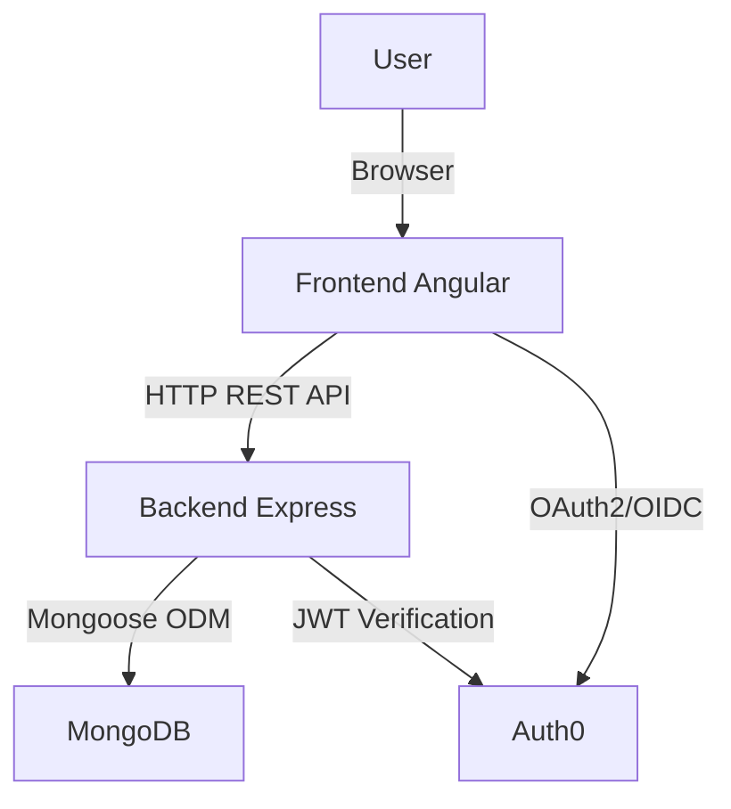

# Architektur-Dokumentation

[TOC]

## 1. Überblick

Das **WEBLAB Techradar** ist eine Web-Applikation, die es ermöglicht, Technologien in einem Radar-Modell zu erfassen, zu kategorisieren und nach Status zu bewerten. Ziel ist es, die Einführung und Bewertung von Technologien im Team transparent und nachvollziehbar zu gestalten.

Das Projekt ist als **Fullstack-Applikation** aufgebaut und nutzt ein modernes Technologie-Setup, das sich an den Best Practices von 2025 orientiert. Es kombiniert **Angular** für das Frontend, **Node.js mit Express** für das Backend und **MongoDB** als Datenbank. Für Authentifizierung und Autorisierung wird **Auth0** als Identity Provider eingesetzt.

Die Architektur folgt dem Prinzip **„Separation of Concerns“** und ist in folgende Schichten aufgeteilt:

- **Frontend (Angular)** – Benutzeroberfläche, Interaktionen, Authentifizierung.
- **Backend (Node.js + Express)** – API, Businesslogik, Zugriffskontrolle.
- **Datenbank (MongoDB)** – Speicherung der Radar-Items.
- **Auth0** – Authentifizierung & Autorisierung.

---

## 2. Architekturdiagramm

---

## 3. Frontend (Angular)

- **Framework:** Angular 17 (Standalone Components, SSR-fähig)
- **Technologien:**

  - `@angular/forms` für Formulareingaben
  - `HttpClient` für REST-Aufrufe
  - `@auth0/auth0-angular` für Authentifizierung

- **Aufgaben:**

  - Darstellung der Technologien in Tabellenform
  - Erstellen, Bearbeiten, Löschen von Radar-Items
  - Login & Logout via Auth0
  - Tokenweitergabe an das Backend (HTTP Interceptor)

- **Besonderheiten:**

  - Nutzung von **Reactive Forms** für Validierungen
  - Einfache Erweiterbarkeit durch Feature-Module

---

## 4. Backend (Node.js + Express)

- **Sprache:** TypeScript
- **Framework:** Express.js
- **Technologien:**

  - `mongoose` zur Anbindung von MongoDB
  - `dotenv` für Konfigurationswerte
  - `express-oauth2-jwt-bearer` für Tokenvalidierung

- **Aufgaben:**

  - REST-API für CRUD-Operationen der Radar-Items
  - Zugriffsschutz über Auth0-Validierung (JWT Tokens)
  - Validierung von Requests (Status, Quadrant, Pflichtfelder)

- **Besonderheiten:**

  - Nutzung von **Middleware** für Fehlerbehandlung und Logging
  - Saubere **Trennung von Routen, Modellen und Logik**

---

## 5. Datenbank (MongoDB)

- **Typ:** Dokumentenorientierte NoSQL-Datenbank
- **Anbindung:** Über `mongoose`
- **Struktur:** Ein `RadarItem`-Schema mit folgenden Feldern:

  - `title: string` – Name der Technologie
  - `status: enum` – z. B. _adopt_, _trial_, _assess_, _hold_
  - `quadrant: enum` – Einordnung in Quadranten
  - `reason: string` – Begründung der Einordnung
  - `description: string` – Beschreibung der Technologie
  - `isPrivate: boolean` – Sichtbarkeit
  - `createdAt`, `updatedAt` – Zeitstempel (automatisch)

---

## 6. Authentifizierung (Auth0)

- **Protokoll:** OAuth2 / OpenID Connect
- **Frontend:** Auth0 Angular SDK übernimmt Login-Fluss
- **Backend:** Validiert JWT-Token mittels `express-oauth2-jwt-bearer`
- **Sicherheit:**

  - Zugriff auf API nur mit gültigem Access Token
  - Audience- und Issuer-Validierung

---

## 7. Entwicklungs- und Deployment-Setup

- **Lokale Entwicklung:**

  - Frontend und Backend laufen separat (`ng serve` & `npm run dev`)
  - MongoDB via Docker Compose (`mongo:7`)

- **Code-Qualität:**

  - ESLint & Prettier für Styleguides
  - Husky Hooks für Pre-Commit Checks

- **CI/CD:**

  - GitHub Actions Workflows (Tests & Linting bei Push)

---

## 8. Vorteile der Technologie-Entscheidungen

1. **Angular (Frontend)**

   - Stabil, weit verbreitet, sehr gute Tooling-Unterstützung
   - Standalone Components reduzieren Boilerplate-Code
   - Einfache Integration mit Auth0

2. **Node.js + Express (Backend)**

   - Schlankes Framework mit klarer Middleware-Architektur
   - TypeScript-Unterstützung für mehr Sicherheit
   - Weit verbreitetes Ökosystem

3. **MongoDB (Datenbank)**

   - Flexibel, da Schema leicht erweiterbar
   - Ideal für JSON-artige Daten wie Radar-Items
   - Sehr gute Integration mit Node.js

4. **Auth0 (Auth)**

   - Delegierte Authentifizierung, keine eigene Userverwaltung nötig
   - Sichere Token-Validierung mit minimalem Setup
   - Skalierbar und leicht erweiterbar (Social Logins, MFA etc.)

5. **Tooling (Linting, CI/CD, VS Code Settings)**

   - Einheitliche Developer Experience
   - Automatische Qualitätskontrollen
   - Weniger Fehler durch Pre-Commit Checks

---

## 9. Fazit & Reflexion

Die Architektur des **WEBLAB Techradar** ist modular, erweiterbar und sicher. Durch die Nutzung moderner Technologien wie Angular, Node.js, MongoDB und Auth0 ergibt sich eine **hohe Produktivität** in der Entwicklung aber für mich persönlich auch nicht eine zu hohe Einstiegshürde. Auth0 aufsetzen und die Konfigurationen verstehen war mit der Hilfe von KI möglich aber selber von Grund auf all diese Verfahren und Methoden implementieren wäre unmöglich gewesen.

Ich hätte gerne mehr gemacht aber ich habe versucht aus den Lehren von WEBT zu schöpfen und mich auf das Minimum zu beschränken aber selbst das musste hier und da Abstriche in Kauf nehmen. Das Projekt ist zwar gleichzeitig **Skalierbar** und relativ **Sicher** (wenn man ignoriert das ich öffentlich das Passwort dazu gepostet habe) doch bei diesem Projekt war leider die Projektplanung und vorallem das Zeitmanagement wieder meine Achillesverse.

Dank CI/CD und Linting-Setup konnte ich einen gewissen Stand and Codequalität einhalten so dass der Code mehrheitlich wartbar und konsistent bleibt aber selbst bei einem perfekten Lint-Setup, können kleine Fehler im .env für Stundenlanges debuggen sorgen.

Nichts desto trotz habe ich diese Lernmöglichkeit geschätzt und geniesse es ein gutes Projekt-Template für zukünftige Coding-Aufgaben zu haben.
